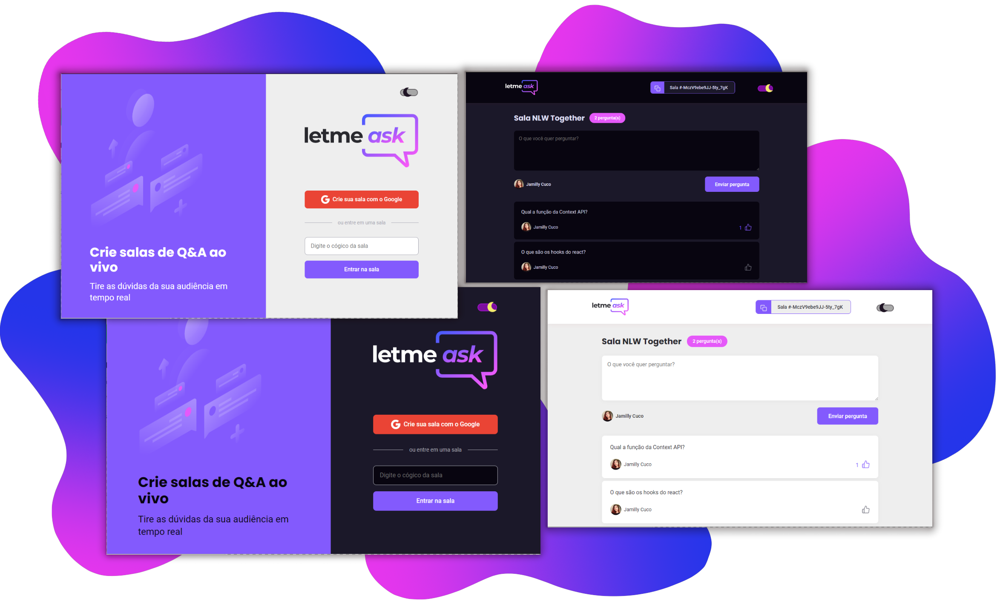

<p align="center">
  
</p>

<p align="center">
  <a href="#-tecnologias">Tecnologias</a>&nbsp;&nbsp;&nbsp;&nbsp;|&nbsp;&nbsp;&nbsp;&nbsp;
  <a href="#-projeto">Projeto</a>&nbsp;&nbsp;&nbsp;&nbsp;|&nbsp;&nbsp;&nbsp;&nbsp;
  <a href="#-como-rodar">Como rodar</a>&nbsp;&nbsp;&nbsp;&nbsp;
</p>

<p align="center">
  
</p>

## 💻 Tecnologias

As tecnologias utilizadas foram:

- React
- TypeScript
- Firebase
- Sass

## 🚀 Projeto

O Let me Ask foi um projeto construído na trilha de ReactJs da NLW Together, evento da Rocketseat.
O projeto apresenta uma proposta de uma aplicação de criação de salas de perguntas e respostas para a audiência de lives ou até mesmo aulas.
As salas podem ser criadas, após a autenticação com a conta google. 
As perguntas das salas apresentam contagem de likes, que permite que o dono da sala saiba quais são as dúvidas que mais interessam a audiência.

## ⚙ Como rodar

### 💻 Pelo site
Acesse o link: [Let me ask](https://letmeask-32ff6.web.app)

### ⚙ Localmente
Clone o repositório com o comando:
``` bash
git clone https://github.com/alt-jams/nlw-together.git 
```
Entre no projeto:
``` bash
cd nlw-together/letmeask
```
instale as dependencias com o comando:
``` bash
yarn
```
Inicie o projeto:
``` bash
yarn start
```
A aplicação estará pronta no endereço http://localhost:3000

<p align="center">
    💜
</p>
